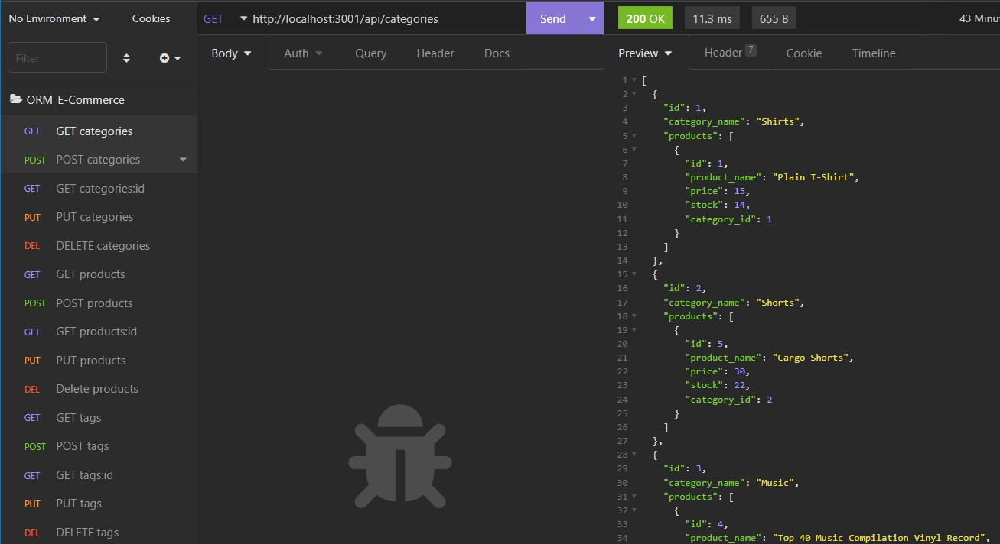

# ORM_E-Commerce, Inc,
https://github.com/SalvadorBanuelos424/ORM_E-Commerce

## Description
E-commerce is a pivotal field for potential Web developers.  Connect clients with database content using API routes.  Know whats in stock, for how much, in what color, its never been easier to keep customers informs.  This App demonstrates the ingenuity of REST APIs, view, post, update and even delete the database from client side Insomnia with ease. 
 
 

 ## Table of Contents
  - [Description](#description)
  - [Installation](#installation)
  - [Built](#Built)
  - [Usage](#usage)
  - [License](#license)
  - [Contribution](#contribution)
  - [Test](#test)
  - [questions](#questions)
  - [Github](#github)
  - [Email](#email)
  
## Installation
Clone git repository, type in terminal "npm i" to install node-modules.
in terminal type "mysql -u root -p" then password "3149".
type in mysql CLI "use ecommerce_db;" to choose the database, 
type "\q" to exit back into terminal
type "npm run seed" to set database seeds
type "npm start" then localhost3000 in Insomnia to follow all transactions.

## Built With 
* JS
* Node.js
* JSON
* MySQL2
* dotenv
* express
* sequelize

## License
This program is licensed by MIT.

## Contributing
Open to all contributions

## Test

## Questions
Feel free to reach out GitHub or email if you have any questions

## GitHub URL
* https://github.com/SalvadorBanuelos424/

## Email
* SBanuelos1234@gmail.com

Made with ❤️ by Salvador Banuelos
### © 2022 ORM_E-Commerce, Inc.